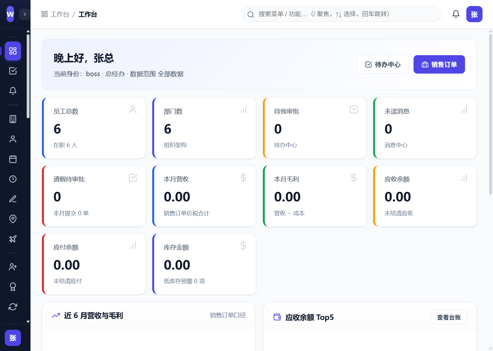
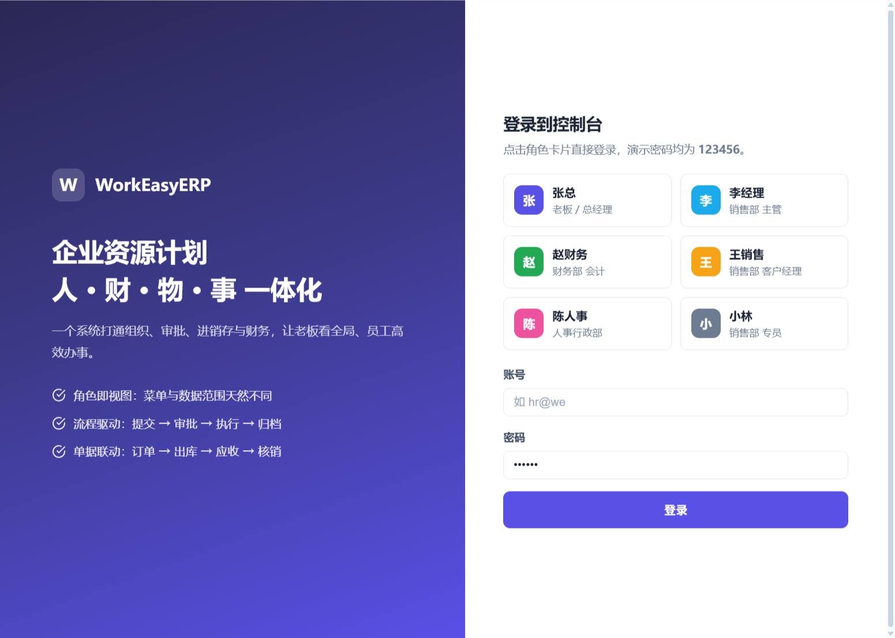
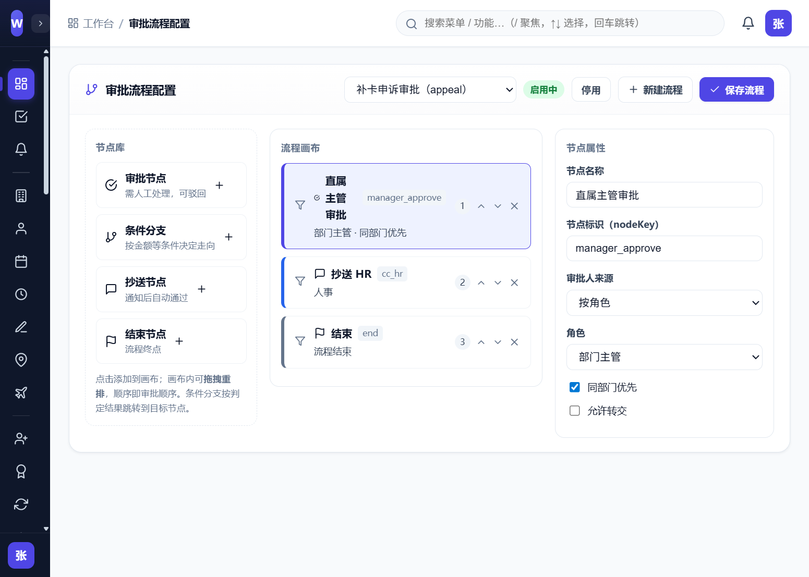
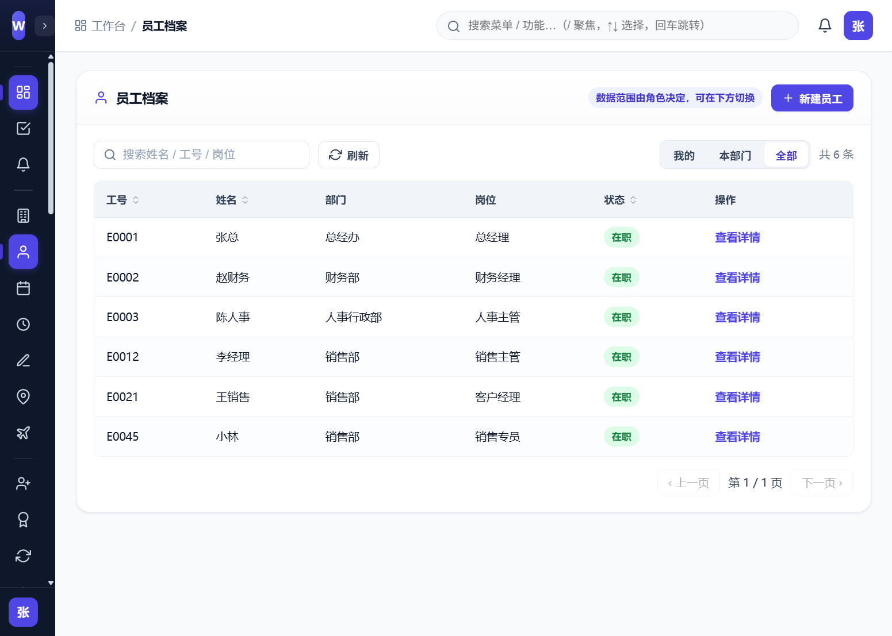
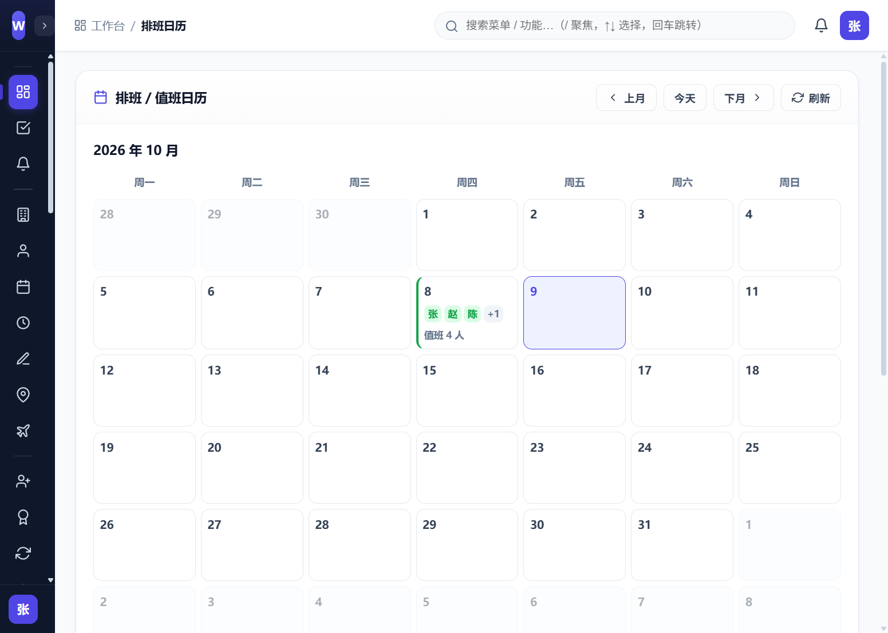
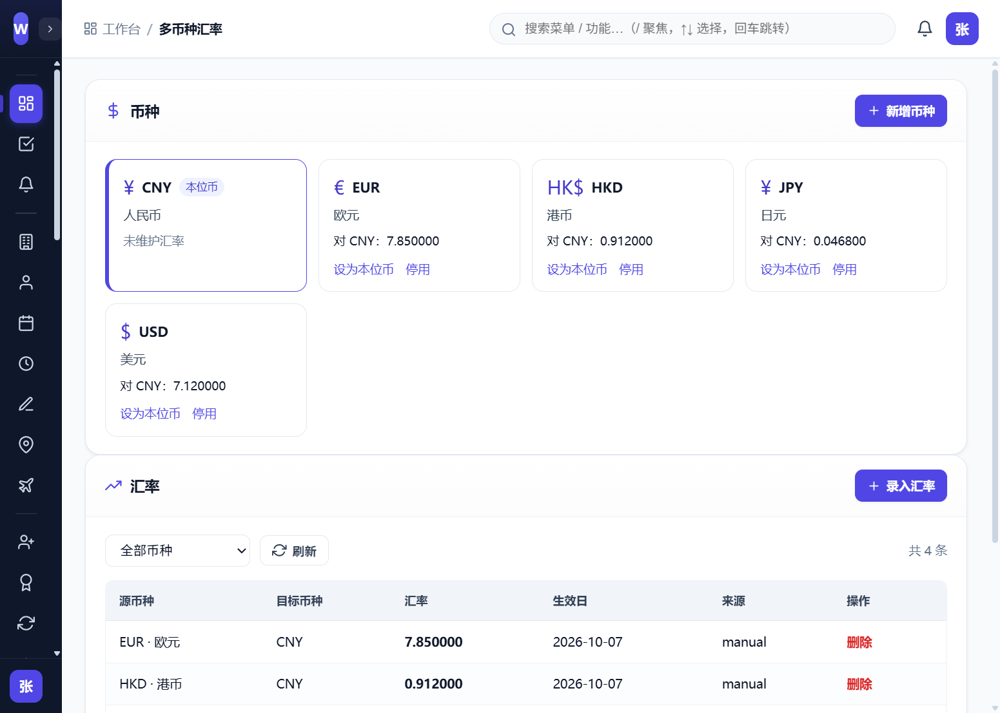
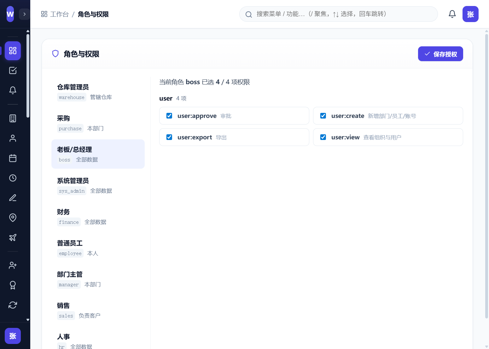

# WorkEasyERP

> 一套自研的全栈 **ERP + OA 一体化**企业管理平台（演示 / 学习用途）。
> 核心理念：**业务流驱动财务流** —— 以可视化工作流引擎串联 HR、OA 审批、进销存、财务与 CRM，并实现业财自动核算。

---

## ✨ 特性

- 🔧 **可视化工作流 / BPM 引擎**：节点拖拽设计、条件分支、审批人按角色/规则解析，支撑复杂审批链。
- 💰 **业财一体化**：出入库审核自动生成应收 / 应付 / 库存 / 成本，业务与财务数据闭环。
- 👥 **HR 全链路**：员工档案、部门、请假、考勤（打卡/班次/排班）、人事事件、薪资、个人中心。
- 📋 **OA 审批协同**：待办中心、消息中心、通用假勤（加班/补卡/外出/出差）、流程配置与单据打印（PDF）。
- 📦 **供应链**：采购申请 → 采购/销售订单 → 出入库履约 → 退货红冲、库存现量、盘点、批次效期预警。
- 🤝 **CRM**：客户、线索、商机、合同，阶段推进与转化闭环。
- 🔐 **字段级权限脱敏**：成本 / 毛利 / 薪资等敏感字段按角色脱敏。
- 🌐 **多币种汇率**：多币种维护与汇率换算，适配外贸场景。
- 📊 **自定义报表 + 仪表盘**：操作审计、灵活报表、工作台看板。

---

## 🖼️ 界面预览

> 以下截图取自真实运行环境（演示种子数据）。



**工作台** · 经营概览卡片、近 6 月营收毛利趋势、应收 Top5

| | |
|---|---|
|  |  |
| **登录页** · 角色卡片一键体验 | **可视化流程设计器** · 节点库 / 流程画布 / 节点属性 |
|  |  |
| **员工档案** · 数据范围按角色切换 | **排班 / 值班日历** · 月度视图与人员值班 |
|  |  |
| **多币种汇率** · 币种卡片与汇率维护 | **角色与权限** · 按角色勾选授权 |

---

## 🧱 技术栈

| 层 | 技术 |
|---|---|
| 前端 | Vue 3 · Vite · TypeScript · Vue Router · Axios · 原生 CSS（设计令牌 `web/src/styles/tokens.css`） |
| 后端 | Kotlin · Spring Boot 3.4 · Spring Data JPA · Flyway · JWT |
| 数据库 | PostgreSQL 15 |
| 其他 | Apache PDFBox（单据打印）· Apache POI（Excel 导出）· spring-security-crypto（口令加密） |

---

## 📁 目录结构

```text
WorkEasyERP/
├── web/                 # 前端：Vue 3 + Vite + TypeScript
│   └── src/
│       ├── views/       # 业务视图
│       ├── components/  # 通用组件（TableShell / AppModal / AppPager / EmptyState …）
│       ├── utils/       # 表单注册表、菜单配置、格式化与状态字典
│       └── styles/      # 设计令牌 tokens.css
├── server/              # 后端：Kotlin + Spring Boot（Gradle 包装器已自带）
│   └── src/main/resources/db/migration/   # Flyway 迁移 V1–V23（含种子数据）
├── screenshots/    # README 界面预览截图
├── docker-compose.yml   # PostgreSQL 15 一键起库
└── README.md
```

---

## 🚀 快速开始

### 环境要求
- **JDK 21**
- **Node.js** 18+（建议 20+）
- **PostgreSQL 15**（可直接用下方 docker-compose）
- Gradle（项目已内置 wrapper，无需单独安装）

### 1. 启动数据库
```bash
docker compose up -d
```
> 数据库名、用户名等默认值见仓库内 `docker-compose.yml` 与 `server/src/main/resources/application.yml`，**生产部署请务必修改**。

### 2. 启动后端
```bash
cd server
./gradlew bootRun
```
- 默认端口：`18080`，上下文路径：`/api`
- 首次启动 Flyway 自动建表并执行 V1–V23 迁移，写入种子数据。

### 3. 启动前端
```bash
cd web
npm install
npm run dev
```
- 默认端口：`5180`，已配置 `/api` 代理到后端 `18080`。
- 浏览器访问：<http://127.0.0.1:5180>

### 演示数据
首次启动由服务端自动初始化演示组织、部门、员工与账号（见 `server` 端 `DataInitializer`，仅在用户表为空时执行）。**演示口令为开发默认值，生产环境请立即修改。**

### 生产构建
```bash
# 前端：产物输出到 web/dist/
cd web && npm run build

# 后端：产物输出到 server/build/libs/
cd server && ./gradlew bootJar
```

---

## 🧩 模块概览

| 域 | 主要模块 |
|---|---|
| HR / 人事 | 员工、部门、请假、考勤、人事事件、薪资、个人中心 |
| OA / 审批 | 待办审批、消息中心、通用假勤、流程配置与可视化设计器、单据打印 |
| 财务 | 应收/应付台账、收付款核销、发票、采购/销售对账、报销 |
| 供应链 | 采购申请、采购/销售订单、出入库履约、退货、库存、盘点、批次效期 |
| CRM | 客户、线索、商机、合同 |
| 系统 | 角色权限、操作审计、基础数据、多币种汇率、附件 |

---

## 🏗️ 架构要点

- **工作流引擎**：可视化节点设计 + 条件分支 + 审批人解析，承载复杂审批链与可审计的节点权限/时效。
- **业财一体化**：业务动作（如入库/出库审核）触发财务凭证自动生成，形成「业务流 → 财务流 → 数据流」闭环。
- **安全**：JWT 鉴权；字段级脱敏（成本/毛利/薪资按角色）；统一异常处理不向客户端泄露堆栈与内部细节。

### 前端工程化
- **声明式表单**：各类「新建 / 发起」表单的字段、校验与提交登记在 `web/src/utils/entityForms.ts`，由统一的 `EntityCreateView` 渲染，避免每个视图重复实现一套表单逻辑。
- **统一列表外壳**：`components/TableShell.vue` 收口「表头 + 空态 + 加载态 + 分页」，各视图只提供自身列与行，全站表格结构与反馈一致。
- **菜单单点配置**：`web/src/utils/menu.ts` 是菜单唯一数据源，侧边栏渲染与顶栏全局搜索共用，避免与路由双份维护。
- **设计令牌**：颜色、间距、字号、圆角、阴影与层级统一定义在 `web/src/styles/tokens.css`。

---

## ⚠️ 部署前注意事项（重要）

1. **修改敏感配置**：上线前务必替换 `application.yml` 中的 JWT 签名密钥与数据库口令（当前为开发默认值）。
2. **外部化配置**：建议通过环境变量或配置中心注入密钥/口令，避免提交到仓库。
3. **忽略构建产物**：上传仓库前请添加 `.gitignore`，忽略 `server/build/`、`server/data/`、`server/boot.log`、`web/node_modules/`、`web/dist/` 等。
4. **开发脚本**：根目录下的 `*.sql` 编码修复脚本与 `endpoints.txt` 为本地排查用产物，请勿纳入生产部署。

---

## 🗺️ 下一阶段开发计划

- 📱 **移动端联动适配**：在现有 Web 响应式基础上，推进移动端（App / 小程序）与 PC 端的数据与流程联动，支持移动审批、移动打卡、消息推送等随身办公场景。
- 🧩 **扩展更多 ERP 服务**：持续补齐企业级 ERP 能力，例如生产制造（MRP / 工单 / 质检）、预算管理、项目管理、文档/知识库、资产管理、会议/用印等模块，进一步完善业财一体化覆盖面。

> 💬 **定制需求**：如有个性化功能定制、私有化部署或行业适配需求，欢迎在仓库 Issue / 讨论区留言，我们会跟进评估。

---

## 📌 许可与免责

- 本项目当前用于**演示与学习**。如需商用或二次分发，请自行确认并补充合适的开源许可证。
- 当前为原型/演示阶段，部分企业级能力（如生产制造、知识库/文档管理、即时通讯、移动端、预算管理等）尚未覆盖，后续按需扩展。

欢迎 Issue 与 PR（如用于学习或二次开发，请遵守相应许可与法律法规）。
